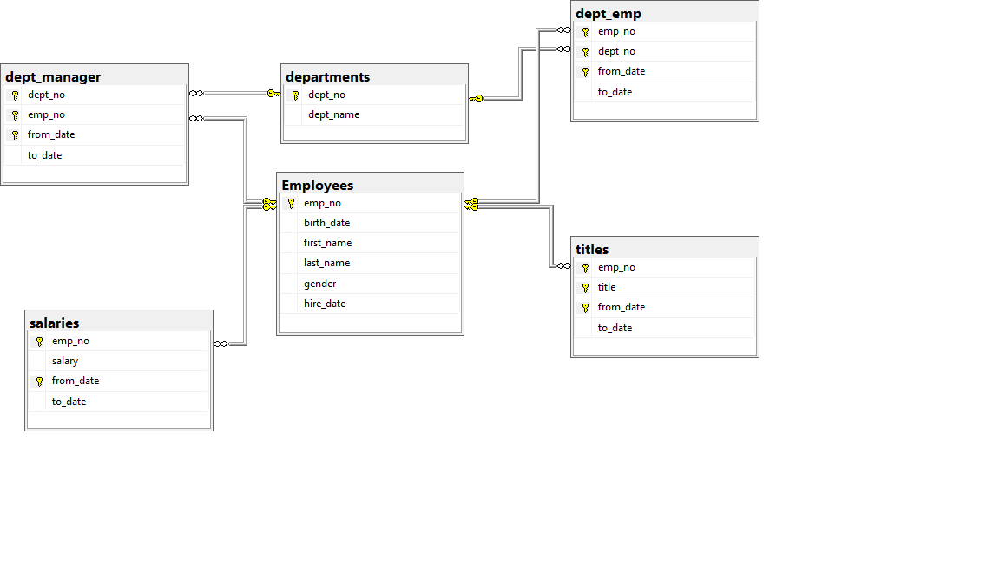

#### Click on Link to go to section
[SQL Homework, Week7](#SQL-Homework,-Week7)
[Database Schema](#Database-Schema)
[Query 1](#Query-1)
[Query 2](#Query-2)
[Query 3](#Query-3)
[Query 4](#Query-4)
[Query 5](#Query-5)
[Query 6](#Query-6)
[Query 7](#Query-7)
[Query 8](#Query-8)
[Query 8b](#Query-8b)

# SQL Homework, Week7

This assignment was supposed to be done with Postgres, but I could not get Postgres to remain stable on either my work computer or my school computer.  One has WIndows 10 Pro, the other WIndows 10 Home.  Both use Malwarebytes and Windows Defender, so maybe one of those is the problem.  In the end I used MSSQL  Server Manager to assist in the design of this database.  To the extent of using the GUI interface to create the tables instead of typing them my hand, one could say I cheated a bit.  However, in practice I NEVER type them by hand;  too prone to errors and lost time chasing those errors.    

One comment I would like you to pass on to Trilogy is to get away from Postgres.  It seems to work reliably on Macs, but for PC's and the eco-systems they live in, it is problematic.  Personally, I think using MS SQL Express and MS SQL Server Manager is likely to be a much more stable solution.  They are both free.

## Database Schema
 
```mssql

USE [Rice_Class_Csv]
GO

/****** Object:  Table [dbo].[departments]    Script Date: 08/10/19 7:44:34 PM ******/
SET ANSI_NULLS ON
GO
SET QUOTED_IDENTIFIER ON
GO
CREATE TABLE [dbo].[departments](
	[dept_no] [nvarchar](50) NOT NULL,
	[dept_name] [nvarchar](50) NOT NULL,
 CONSTRAINT [PK_departments] PRIMARY KEY CLUSTERED 
(
	[dept_no] ASC
)WITH (PAD_INDEX = OFF, STATISTICS_NORECOMPUTE = OFF, IGNORE_DUP_KEY = OFF, ALLOW_ROW_LOCKS = ON, ALLOW_PAGE_LOCKS = ON) ON [PRIMARY]
) ON [PRIMARY]
GO
/****** Object:  Table [dbo].[dept_emp]    Script Date: 08/10/19 7:44:34 PM ******/
SET ANSI_NULLS ON
GO
SET QUOTED_IDENTIFIER ON
GO
CREATE TABLE [dbo].[dept_emp](
	[emp_no] [int] NOT NULL,
	[dept_no] [nvarchar](50) NOT NULL,
	[from_date] [date] NOT NULL,
	[to_date] [date] NOT NULL,
 CONSTRAINT [PK_dept_emp] PRIMARY KEY CLUSTERED 
(
	[emp_no] ASC,
	[dept_no] ASC,
	[from_date] ASC
)WITH (PAD_INDEX = OFF, STATISTICS_NORECOMPUTE = OFF, IGNORE_DUP_KEY = OFF, ALLOW_ROW_LOCKS = ON, ALLOW_PAGE_LOCKS = ON) ON [PRIMARY]
) ON [PRIMARY]
GO
/****** Object:  Table [dbo].[dept_manager]    Script Date: 08/10/19 7:44:34 PM ******/
SET ANSI_NULLS ON
GO
SET QUOTED_IDENTIFIER ON
GO
CREATE TABLE [dbo].[dept_manager](
	[dept_no] [nvarchar](50) NOT NULL,
	[emp_no] [int] NOT NULL,
	[from_date] [date] NOT NULL,
	[to_date] [date] NOT NULL,
 CONSTRAINT [PK_dept_manager] PRIMARY KEY CLUSTERED 
(
	[dept_no] ASC,
	[emp_no] ASC,
	[from_date] ASC
)WITH (PAD_INDEX = OFF, STATISTICS_NORECOMPUTE = OFF, IGNORE_DUP_KEY = OFF, ALLOW_ROW_LOCKS = ON, ALLOW_PAGE_LOCKS = ON) ON [PRIMARY]
) ON [PRIMARY]
GO
/****** Object:  Table [dbo].[Employees]    Script Date: 08/10/19 7:44:34 PM ******/
SET ANSI_NULLS ON
GO
SET QUOTED_IDENTIFIER ON
GO
CREATE TABLE [dbo].[Employees](
	[emp_no] [int] NOT NULL,
	[birth_date] [date] NOT NULL,
	[first_name] [nvarchar](50) NOT NULL,
	[last_name] [nvarchar](50) NOT NULL,
	[gender] [nvarchar](50) NOT NULL,
	[hire_date] [date] NOT NULL,
 CONSTRAINT [PK_Employees] PRIMARY KEY CLUSTERED 
(
	[emp_no] ASC
)WITH (PAD_INDEX = OFF, STATISTICS_NORECOMPUTE = OFF, IGNORE_DUP_KEY = OFF, ALLOW_ROW_LOCKS = ON, ALLOW_PAGE_LOCKS = ON) ON [PRIMARY]
) ON [PRIMARY]
GO
/****** Object:  Table [dbo].[salaries]    Script Date: 08/10/19 7:44:34 PM ******/
SET ANSI_NULLS ON
GO
SET QUOTED_IDENTIFIER ON
GO
CREATE TABLE [dbo].[salaries](
	[emp_no] [int] NOT NULL,
	[salary] [int] NOT NULL,
	[from_date] [date] NOT NULL,
	[to_date] [date] NOT NULL,
 CONSTRAINT [PK_salaries] PRIMARY KEY CLUSTERED 
(
	[emp_no] ASC,
	[from_date] ASC
)WITH (PAD_INDEX = OFF, STATISTICS_NORECOMPUTE = OFF, IGNORE_DUP_KEY = OFF, ALLOW_ROW_LOCKS = ON, ALLOW_PAGE_LOCKS = ON) ON [PRIMARY]
) ON [PRIMARY]
GO
/****** Object:  Table [dbo].[titles]    Script Date: 08/10/19 7:44:34 PM ******/
SET ANSI_NULLS ON
GO
SET QUOTED_IDENTIFIER ON
GO
CREATE TABLE [dbo].[titles](
	[emp_no] [int] NOT NULL,
	[title] [nvarchar](50) NOT NULL,
	[from_date] [date] NOT NULL,
	[to_date] [date] NOT NULL,
 CONSTRAINT [PK_titles] PRIMARY KEY CLUSTERED 
(
	[emp_no] ASC,
	[title] ASC,
	[from_date] ASC
)WITH (PAD_INDEX = OFF, STATISTICS_NORECOMPUTE = OFF, IGNORE_DUP_KEY = OFF, ALLOW_ROW_LOCKS = ON, ALLOW_PAGE_LOCKS = ON) ON [PRIMARY]
) ON [PRIMARY]
GO
ALTER TABLE [dbo].[dept_emp]  WITH CHECK ADD  CONSTRAINT [FK_dept_emp_departments] FOREIGN KEY([dept_no])
REFERENCES [dbo].[departments] ([dept_no])
GO
ALTER TABLE [dbo].[dept_emp] CHECK CONSTRAINT [FK_dept_emp_departments]
GO
ALTER TABLE [dbo].[dept_emp]  WITH CHECK ADD  CONSTRAINT [FK_dept_emp_Employees] FOREIGN KEY([emp_no])
REFERENCES [dbo].[Employees] ([emp_no])
GO
ALTER TABLE [dbo].[dept_emp] CHECK CONSTRAINT [FK_dept_emp_Employees]
GO
ALTER TABLE [dbo].[dept_manager]  WITH CHECK ADD  CONSTRAINT [FK_dept_manager_departments] FOREIGN KEY([dept_no])
REFERENCES [dbo].[departments] ([dept_no])
GO
ALTER TABLE [dbo].[dept_manager] CHECK CONSTRAINT [FK_dept_manager_departments]
GO
ALTER TABLE [dbo].[dept_manager]  WITH CHECK ADD  CONSTRAINT [FK_dept_manager_Employees] FOREIGN KEY([emp_no])
REFERENCES [dbo].[Employees] ([emp_no])
GO
ALTER TABLE [dbo].[dept_manager] CHECK CONSTRAINT [FK_dept_manager_Employees]
GO
ALTER TABLE [dbo].[salaries]  WITH CHECK ADD  CONSTRAINT [FK_salaries_Employees] FOREIGN KEY([emp_no])
REFERENCES [dbo].[Employees] ([emp_no])
GO
ALTER TABLE [dbo].[salaries] CHECK CONSTRAINT [FK_salaries_Employees]
GO
ALTER TABLE [dbo].[titles]  WITH CHECK ADD  CONSTRAINT [FK_titles_Employees] FOREIGN KEY([emp_no])
REFERENCES [dbo].[Employees] ([emp_no])
GO
ALTER TABLE [dbo].[titles] CHECK CONSTRAINT [FK_titles_Employees]
GO
```
#### Click on Link to go to section
[SQL Homework, Week7](#SQL-Homework,-Week7)
[Database Schema](#Database-Schema)
[Query 1](#Query-1)
[Query 2](#Query-2)
[Query 3](#Query-3)
[Query 4](#Query-4)
[Query 5](#Query-5)
[Query 6](#Query-6)
[Query 71](#Query-7)
[Query 8](#Query-8)
[Query 8b](#Query-8b)
## Diagram

Probably the trickiest part of this is to recognize that the primary keys for dept_manager,dept_emp and titles need to include the from_date column.  This is because employees are moved around over the course of their careers in the company.  A manager, for example, may be moved  to another department for a time, and then transferred back later.

#
#### Click on Link to go to section
[SQL Homework, Week7](#SQL-Homework,-Week7)
[Database Schema](#Database-Schema)
[Query 1](#Query-1)
[Query 2](#Query-2)
[Query 3](#Query-3)
[Query 4](#Query-4)
[Query 5](#Query-5)
[Query 6](#Query-6)
[Query 7](#Query-7)
[Query 8](#Query-8)
[Query 8b](#Query-8b)
## Query 1
```mssql
select TOP 5 e.emp_no, e.gender,e.last_name, e.first_name, s.salary
from employees as e 
INNER JOIN Salaries as s
on e.emp_no = s.emp_no
order by s.salary desc
```


#### Q1 Output

| emp_no | gender | last_name   | first_name | salary |
| ------ | ------ | ----------- | ---------- | ------ |
| 205000 | M      | Griswold    | Charmane   | 129492 |
| 37558  | M      | Thambidurai | Juichirou  | 125469 |
| 44188  | M      | Peac        | Slavian    | 127238 |
| 444756 | M      | Varker      | Nahid      | 127041 |
| 458302 | M      | Esposito    | Poorav     | 126703 |
#### Click on Link to go to section
[SQL Homework, Week7](#SQL-Homework,-Week7)
[Database Schema](#Database-Schema)
[Query 1](#Query-1)
[Query 2](#Query-2)
[Query 3](#Query-3)
[Query 4](#Query-4)
[Query 5](#Query-5)
[Query 6](#Query-6)
[Query 7](#Query-7)
[Query 8](#Query-8)
[Query 8b](#Query-8b)


## Query 2
```
select TOP 5 e.emp_no, e.gender,e.last_name, e.first_name
from employees as e
Where Year(e.hire_date )= 1986
order by e.last_name, e.first_name desc
```


#### Q2 Output

| emp_no | gender | last_name | first_name |
| ------ | ------ | --------- | ---------- |
| 271789 | F      | Aamodt    | Valeri     |
| 280448 | M      | Aamodt    | Theron     |
| 251782 | F      | Aamodt    | Somnath    |
| 295537 | M      | Aamodt    | Shmuel     |
| 260324 | M      | Aamodt    | Salvador   |
#### Click on Link to go to section
[SQL Homework, Week7](#SQL-Homework,-Week7)
[Database Schema](#Database-Schema)
[Query 1](#Query-1)
[Query 2](#Query-2)
[Query 3](#Query-3)
[Query 4](#Query-4)
[Query 5](#Query-5)
[Query 6](#Query-6)
[Query 7](#Query-7)
[Query 8](#Query-8)
[Query 8b](#Query-8b)
## Query 3
```
USE [Rice_Class_Csv]
GO
select d.dept_no,dp.dept_name,d.from_date,d.to_date,s.salary,e.last_name,e.first_name,e.hire_date
from dept_manager as d
inner join
salaries as s on d.emp_no= s.emp_no
inner join
employees as e  on e.emp_no = d.emp_no
inner join
departments as dp on dp.dept_no=d.dept_no
Where Year(d.to_date )= 9999
order by d.dept_no
```


#### Q3 Output

| dept_no | dept_name          | from_date  | to_date    | salary | last_name  | first_name | hire_date  |
| ------- | ------------------ | ---------- | ---------- | ------ | ---------- | ---------- | ---------- |
| d001    | Marketing          | 1991-10-01 | 9999-01-01 | 69941  | Minakawa   | Vishwani   | 1986-04-12 |
| d002    | Finance            | 1989-12-17 | 9999-01-01 | 52070  | Legleitner | Isamu      | 1985-01-14 |
| d003    | Human Resources    | 1992-03-21 | 9999-01-01 | 40000  | Sigstam    | Karsten    | 1985-08-04 |
| d004    | Production         | 1996-08-30 | 9999-01-01 | 40000  | Ghazalie   | Oscar      | 1992-02-05 |
| d005    | Development        | 1992-04-25 | 9999-01-01 | 40000  | DasSarma   | Leon       | 1986-10-21 |
| d006    | Quality Management | 1994-06-28 | 9999-01-01 | 45169  | Pesch      | Dung       | 1989-06-09 |
| d007    | Sales              | 1991-03-07 | 9999-01-01 | 71148  | Zhang      | Hauke      | 1986-12-30 |
| d008    | Research           | 1991-04-08 | 9999-01-01 | 48077  | Kambil     | Hilary     | 1988-01-31 |
| d009    | Customer Service   | 1996-01-03 | 9999-01-01 | 40000  | Weedman    | Yuchang    | 1989-07-10 |
#### Click on Link to go to section
[SQL Homework, Week7](#SQL-Homework,-Week7)
[Database Schema](#Database-Schema)
[Query 1](#Query-1)
[Query 2](#Query-2)
[Query 3](#Query-3)
[Query 4](#Query-4)
[Query 5](#Query-5)
[Query 6](#Query-6)
[Query 7](#Query-7)
[Query 8](#Query-8)
[Query 8b](#Query-8b)
## Query 4
```
SELECT TOP 10 de.emp_no, de.dept_no,d.dept_name,e.last_name,e.first_name
From dept_emp as de
inner join 
employees as e on de.emp_no=e.emp_no
inner join 
departments as d on de.dept_no= d.dept_no
where year(de.to_date)= 9999
order by de.emp_no desc
```


#### Q4 Output

| emp_no | dept_no | dept_name        | last_name    | first_name |
| ------ | ------- | ---------------- | ------------ | ---------- |
| 499999 | d004    | Production       | Tsukuda      | Sachin     |
| 499998 | d002    | Finance          | Breugel      | Patricia   |
| 499997 | d005    | Development      | Lenart       | Berhard    |
| 499996 | d004    | Production       | Baaz         | Zito       |
| 499995 | d004    | Production       | Lichtner     | Dekang     |
| 499993 | d004    | Production       | Mullainathan | DeForest   |
| 499992 | d001    | Marketing        | Salverda     | Siamak     |
| 499991 | d009    | Customer Service | Sichman      | Pohua      |
| 499990 | d005    | Development      | Kohling      | Khaled     |
| 499987 | d007    | Sales            | Dusink       | Rimli      |
#### Click on Link to go to section
[SQL Homework, Week7](#SQL-Homework,-Week7)
[Database Schema](#Database-Schema)
[Query 1](#Query-1)
[Query 2](#Query-2)
[Query 3](#Query-3)
[Query 4](#Query-4)
[Query 5](#Query-5)
[Query 6](#Query-6)
[Query 7](#Query-7)
[Query 8](#Query-8)
[Query 8b](#Query-8b)
## Query 5
```
Select TOP 20 e.first_name, e.last_name, e.emp_no from
employees as e
where e.first_name='Hercules'
and e.last_name like 'B%'
order by e.last_name asc
```


#### Q5 Output

| first_name | last_name | emp_no |
| ---------- | --------- | ------ |
| Hercules   | Baak      | 438081 |
| Hercules   | Baer      | 38161  |
| Hercules   | Bahr      | 435221 |
| Hercules   | Bail      | 213553 |
| Hercules   | Bain      | 294352 |
#### Click on Link to go to section
[SQL Homework, Week7](#SQL-Homework,-Week7)
[Database Schema](#Database-Schema)
[Query 1](#Query-1)
[Query 2](#Query-2)
[Query 3](#Query-3)
[Query 4](#Query-4)
[Query 5](#Query-5)
[Query 6](#Query-6)
[Query 7](#Query-7)
[Query 8](#Query-8)
[Query 8b](#Query-8b)


## Query 6

```
select TOP 20 de.emp_no,e.last_name,e.first_name,d.dept_name
from dept_emp as de
inner join
departments as d on d.dept_no=de.dept_no
inner join
employees as e on de.emp_no = e.emp_no
where d.dept_name='Sales' and year(de.to_date)=9999
```


#### Q6 Output

| emp_no | last_name   | first_name | dept_name |
| ------ | ----------- | ---------- | --------- |
| 10002  | Simmel      | Bezalel    | Sales     |
| 10016  | Cappelletti | Kazuhito   | Sales     |
| 10041  | Lenart      | Uri        | Sales     |
| 10050  | Dredge      | Yinghua    | Sales     |
| 10053  | Zschoche    | Sanjiv     | Sales     |
#### Click on Link to go to section
[SQL Homework, Week7](#SQL-Homework,-Week7)
[Database Schema](#Database-Schema)
[Query 1](#Query-1)
[Query 2](#Query-2)
[Query 3](#Query-3)
[Query 4](#Query-4)
[Query 5](#Query-5)
[Query 6](#Query-6)
[Query 7](#Query-7)
[Query 8](#Query-8)
[Query 8b](#Query-8b)
## Query 7
```
select TOP 20 de.emp_no,e.last_name,e.first_name,d.dept_name
from dept_emp as de
inner join
departments as d on d.dept_no=de.dept_no
inner join
employees as e on de.emp_no = e.emp_no
where (d.dept_name='Sales' or d.dept_name='Development') and year(de.to_date)=9999
order by e.last_name asc
```


#### Q7 

| emp_no | last_name | first_name | dept_name   |
| ------ | --------- | ---------- | ----------- |
| 102734 | Aamodt    | Woody      | Development |
| 103125 | Aamodt    | Huican     | Sales       |
| 61477  | Aamodt    | Jenwei     | Development |
| 36577  | Aamodt    | Mahmut     | Development |
| 276101 | Aamodt    | Deborah    | Development |
#### Click on Link to go to section
[SQL Homework, Week7](#SQL-Homework,-Week7)
[Database Schema](#Database-Schema)
[Query 1](#Query-1)
[Query 2](#Query-2)
[Query 3](#Query-3)
[Query 4](#Query-4)
[Query 5](#Query-5)
[Query 6](#Query-6)
[Query 7](#Query-7)
[Query 8](#Query-8)
[Query 8b](#Query-8b)
## Query 8
```mssql
Select distinct top 20 e.last_name,l.countoflastname
	from Employees as e
		inner join(select last_name,count(last_name) as countoflastname
			from employees group by last_name) as l on e.last_name = l.last_name
			order by countoflastname desc
			```

#### Q8 Output

| last_name | countoflastname |
| --------- | --------------- |
| Baba      | 226             |
| Coorg     | 223             |
| Gelosh    | 223             |
| Farris    | 222             |
| Sudbeck   | 222             |

```
#### Click on Link to go to section
[SQL Homework, Week7](#SQL-Homework,-Week7)
[Database Schema](#Database-Schema)
[Query 1](#Query-1)
[Query 2](#Query-2)
[Query 3](#Query-3)
[Query 4](#Query-4)
[Query 5](#Query-5)
[Query 6](#Query-6)
[Query 7](#Query-7)
[Query 8](#Query-8)
[Query 8b](#Query-8b)
## Query 8.b
SELECT  TOP 20 e.last_name, COUNT(*)  as countofnames
from employees as e
Group by e.last_name
order by e.last_name
```

#### Q8b Output

I have included this to show how much different queries that do the same thing can be.  This query is far faster than the previous query, and far more simple in it's construction.

| last_name      | countofnames |
| -------------- | ------------ |
| Aamodt         | 205          |
| Acton          | 189          |
| Adachi         | 221          |
| Aingworth      | 172          |
| Akaboshi       | 199          |
| Akazan         | 207          |
| Akiyama        | 170          |
| Alameldin      | 195          |
| Albarhamtoshy  | 201          |
| Alblas         | 193          |
| Alencar        | 170          |
| Aloia          | 208          |
| Aloisi         | 164          |
| Alpay          | 183          |
| Alpin          | 204          |
| Alvarado       | 175          |
| Ambroszkiewicz | 173          |
| Anandan        | 190          |
| Ananiadou      | 160          |
| Andreotta      | 165          |
